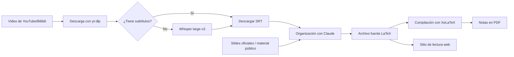

<div align="center">

# 📚 AI Course Notes

**Idioma:** Español (México) · [中文](README-zh.md)

**370 notas de AI / LLM en chino, con lectura en línea, consulta del código fuente LaTeX y compilación local a PDF**

Elaboradas a partir de subtítulos de videos de cursos abiertos, slides de los cursos, entrevistas, artículos técnicos y material público; se generan como PDF con LaTeX y se publican automáticamente como un sitio de lectura con búsqueda.

[](https://hqhq1025.github.io/ai-course-notes/)
[](.)
[](.)
[](.)

[🌐 Lectura en línea](https://hqhq1025.github.io/ai-course-notes/) · [📄 Ver el catálogo](#-catálogo-de-cursos) · [🤝 Contribuir](CONTRIBUTING.md)

</div>

---

## ✨ Qué es

- **Prioridad a la lectura en línea**: el sitio web ofrece navegación por índice, búsqueda de texto completo y visualización de fórmulas; el texto carga por defecto imágenes optimizadas, y al hacer clic se abre la imagen original del repositorio.
- **Notas en chino**: los cursos, entrevistas y artículos en inglés se reorganizan en chino, y los términos técnicos clave se conservan en inglés.
- **Amplia cobertura**: desde Transformer, LLM pretraining y RLHF hasta Agent, Diffusion, Infra, arquitectura de modelos y práctica de ingeniería de AI.
- **LaTeX como fuente**: el repositorio conserva los `*-notes.tex` y sus imágenes; el sitio web se genera automáticamente a partir de los `.tex`, y los PDF de las notas se compilan localmente sin volver a guardarse en Git.
- **Actualización continua**: se seguirán agregando nuevos cursos, conferencias, entrevistas y artículos técnicos.

## 🌐 Lectura en línea

Sitio en línea: **[https://hqhq1025.github.io/ai-course-notes/](https://hqhq1025.github.io/ai-course-notes/)**

[tools/web/generate_site.py](tools/web/generate_site.py) genera automáticamente un proyecto de MkDocs a partir de las notas LaTeX del repositorio, y [.github/workflows/pages.yml](.github/workflows/pages.yml) lo despliega en GitHub Pages cada vez que se actualiza la rama `main`.

> La mayoría de los usuarios **no necesita clonar** el repositorio: basta con visitar el sitio en línea para leer y buscar en las 370 notas.

## 📥 Guía de clonado

El historial del repositorio acumula una gran cantidad de PDF, imágenes y subtítulos, por lo que un clon completo es voluminoso (varios GB). Elija el método de clonado según lo que necesite:

| Método | Comando | Caso de uso | Tamaño aproximado |
|------|------|----------|----------|
| **Shallow clone** | `git clone --depth=1 https://github.com/hqhq1025/ai-course-notes.git` | Solo se quiere leer la versión más reciente (recomendado) | Cientos de MB |
| **Blobless clone** | `git clone --filter=blob:none https://github.com/hqhq1025/ai-course-notes.git` | Se quiere el historial completo, pero descargando el contenido de los archivos bajo demanda | ~2 GB |
| **Sparse checkout** | Ver abajo | Solo interesa un curso (por ejemplo, cs336) | Decenas de MB |
| **Clon completo** | `git clone https://github.com/hqhq1025/ai-course-notes.git` | Se quiere todo el historial y todos los archivos | Varios GB |

Clonar solo un curso (con cs336 como ejemplo):

```bash
git clone --filter=blob:none --no-checkout https://github.com/hqhq1025/ai-course-notes.git
cd ai-course-notes
git sparse-checkout init --cone
git sparse-checkout set cs336
git checkout main
```

## 📄 PDF y LaTeX

- **Lectura directa**: se recomienda el [sitio de lectura en línea](https://hqhq1025.github.io/ai-course-notes/), que no requiere descargar PDF; las imágenes del sitio son copias optimizadas, y al hacer clic en una imagen se abre la original.
- **Código fuente LaTeX**: cada nota en línea tiene en la parte superior un acceso al “código fuente LaTeX”; también se puede clonar el repositorio y consultar directamente el `*-notes.tex` correspondiente.
- **Generar el PDF por cuenta propia**: el repositorio ya no incluye los `*-notes.pdf`, porque pueden regenerarse a partir del código fuente. Después de descargar el directorio del curso, basta con compilar dos veces seguidas con XeLaTeX para obtener un PDF con índice y referencias cruzadas completos.
- **Materiales oficiales**: los `*-slides.pdf` publicados por los responsables del curso no pueden reconstruirse a partir del código fuente de las notas, por lo que se conservan.

```bash
git clone --depth=1 https://github.com/hqhq1025/ai-course-notes.git
cd ai-course-notes/<course>/<lecture>
xelatex -interaction=nonstopmode -halt-on-error <lecture>-notes.tex
xelatex -interaction=nonstopmode -halt-on-error <lecture>-notes.tex
```

Por ejemplo, para compilar la primera clase de CS329A:

```bash
cd ai-course-notes/cs329a/lecture01
xelatex -interaction=nonstopmode -halt-on-error lecture01-notes.tex
xelatex -interaction=nonstopmode -halt-on-error lecture01-notes.tex
```

## 📊 Alcance del contenido

| Categoría | Cantidad | Descripción |
|------|------|------|
| Cursos de Stanford | 169 | CS329A, CS336, CS224R, CS25, CS153, CS146S, CS224N, CS231N |
| Cursos del MIT | 10 | MIT 6.S191 Introduction to Deep Learning |
| Cursos de KAIST | 15 | CS492D Diffusion Models and Flow Models |
| Cursos de Berkeley | 36 | CS294 LLM Agents / Advanced LLM Agents / Agentic AI |
| Series de cursos de Bilibili | 48 | Modern Agent, LLM Architect, Agentic RL, Self-Evolving Agents 2026 |
| Conferencias y entrevistas | 67 | Lex Fridman, Dwarkesh Patel, Qingke (青稞), WhynotTV, Zhang Xiaojun (张小珺), entre otros |
| Notas de artículos técnicos | 25 | Agent Harness, Claude Code, Codex, Agentic Memory, entre otros |
| **Total** | **370** | Criterio de conteo: archivos fuente de notas `*-notes.tex` del repositorio |

---

## 📋 Catálogo de cursos

### 🏫 Cursos de Stanford (169 notas)

| Curso | Tema | Clases | Docentes |
|------|------|------|------|
| [**CS329A**](cs329a/) | Self-Improving AI Agents | 9 | Aakanksha Chowdhery, Azalia Mirhoseini |
| [**CS336**](cs336/) / [**CS336 2026**](cs336-2026/) | Language Modeling from Scratch | 17 + 18 | Percy Liang, Tatsu Hashimoto |
| [**CS224R**](cs224r/) | Deep Reinforcement Learning | 19 | Chelsea Finn |
| [**CS25**](cs25/) / [**CS25 V6**](cs25-v6/) | Transformers United (V1-V6) | 41 + 9 | Hinton, Karpathy, Vaswani, Noam Brown... |
| [**CS153**](cs153/) | Infra @ Scale / Frontier Systems | 11 | Anjney Midha + líderes de la industria |
| [**CS146S**](cs146s/) | The Modern Software Developer | 10 | Mihail Eric + invitados de la industria |
| [**CS224N**](cs224n/) | NLP with Deep Learning | 17 | Chris Manning |
| [**CS231N**](cs231n/) | Deep Learning for Computer Vision | 18 | — |

> **Segunda reescritura de CS336 Spring 2026 terminada (2026-08-11)**: 18/18 clases, con 607 páginas, 561 figuras y 824 recuadros didácticos; todas aprobaron la strict source coverage, la revisión de calidad `⭐⭐⭐`, la doble compilación con XeLaTeX y la QA visual manual del PDF. Las clases que tienen transcript o executable narration incluyen su teacher-voice ledger.

> **Reescritura completa de CS25 V1--V5 terminada (2026-08-12)**: 41/41 clases, con 2,021 páginas, 2,051 figuras y 1,598 recuadros didácticos; todas se reconstruyeron con el flujo de trabajo source-first y aprobaron la strict coverage, `⭐⭐⭐`, la doble compilación con XeLaTeX y la QA visual manual del PDF. Con cada clase se guardan las slides oficiales, los teaching states recuperados de la grabación, el teacher-voice ledger, la coverage matrix y el informe de QA.

> **Generación completa de CS25 V6 terminada (2026-08-13)**: 9/9 clases, con 472 páginas, 474 figuras didácticas y 393 recuadros didácticos; todas se elaboraron con el proceso source-first / teacher-voice / slide-complete y aprobaron la strict coverage, `⭐⭐⭐`, la doble compilación estable con XeLaTeX y la QA visual manual del PDF. La Lecture 09 `Serving Transformers: Lessons from the Trenches of Production Inference` tiene 59 páginas, cubre 57 páginas required del deck oficial + 1 live token-timing demo, e incluye 71 recuadros didácticos, 12 bloques de fórmulas y 7 listings de código; se auditaron completas las 990 muestras tomadas cada cinco segundos de la grabación de 82:31 y 17 contact sheets, y el apéndice de CI/CL y las páginas de reclutamiento, que no se expusieron en la grabación, no se presentaron como contenido de la clase. El alcance del curso y los enlaces oficiales están registrados en [`cs25-v6/COURSE_SCOPE.md`](cs25-v6/COURSE_SCOPE.md).

### 🏛 Cursos del MIT (10 notas)

| Curso | Tema | Clases | Docentes |
|------|------|------|------|
| [**6.S191**](6s191/) | Introduction to Deep Learning | 10 | Alexander Amini + invitados de la industria |

### 🇰🇷 Cursos de KAIST (15 notas)

| Curso | Tema | Clases | Docentes |
|------|------|------|------|
| [**CS492D**](kaist-cs492d/) | Diffusion Models and Flow Models | 15 | Minhyuk Sung |

### 🐻 Cursos de Berkeley (36 notas)

| Curso | Tema | Clases | Invitados destacados |
|------|------|------|----------|
| [**CS294 F24**](talks/berkeley-llm-agents/f24/) | LLM Agents | 12 | Denny Zhou, Yao Shunyu (姚顺雨), Jim Fan, Percy Liang |
| [**CS294 SP25**](talks/berkeley-llm-agents/sp25/) | Advanced LLM Agents | 12 | Jason Weston, AlphaProof, Salakhutdinov |
| [**CS294 F25**](talks/berkeley-llm-agents/f25/) | Agentic AI | 12 | Yann Dubois, Noam Brown, Oriol Vinyals, Dawn Song |

> **Reescritura completa de Agentic AI MOOC Fall 2025 terminada (2026-08-18)**: 12/12 clases, con 497 páginas, 472 elementos visuales didácticos y 589 recuadros didácticos; en todas se reconstruyeron, en el orden cronológico oficial, el source manifest, la coverage matrix, el teacher-voice ledger y la nota de fuentes, y todas aprobaron la strict coverage, `⭐⭐⭐`, la doble compilación con XeLaTeX y la QA visual del PDF con aprobación firmada.

### 🇨🇳 Series de cursos de Bilibili (48 notas)

| Serie | Tema | Clases | Autor en Bilibili |
|------|------|------|------|
| [**Modern Agent**](modern-agent/) | LLM Agent en la práctica (ReAct, RAG, Codex) | 17 | Wudaokou Nash (五道口纳什) |
| [**LLM Architect**](llm-architect/) | Arquitectura de modelos (MoE, RoPE, VLM, K2.5) | 10 | Wudaokou Nash (五道口纳什) |
| [**Agentic RL**](agentic-rl/) | RL for LLM (PPO→GRPO→DPO, veRL) | 20 | Wudaokou Nash (五道口纳什) |
| [**Self-Evolving Agents 2026**](self-evolving-agents-2026/) | Modelos causales del mundo, Agentic RL, inteligencia basada en la experiencia, externalización de capacidades y teoría de Agent | 1 volumen / 9 unidades | NICE Academic (NICE 学术) |

### 🎤 Conferencias y entrevistas (67 notas)

| Fuente / canal | Tema | Cantidad | Directorio |
|-------------|------|------|------|
| [**Lex Fridman Podcast**](talks/lex-fridman/) | Dario Amodei, Jensen Huang, State of AI, DeepSeek, la AI en China, OpenClaw | 5 | talks |
| [**AITIME Lundao (AITIME 论道)**](talks/aitime/) | Zhang Bo (张钹), Lin Junyang (林俊旸), Yao Shunyu (姚顺雨), Yang Zhilin (杨植麟) | 4 | talks |
| [**Comunidad Qingke (青稞社区)**](talks/qingke/) | Mesas redondas sobre LLM, Agentic, RL e Infra | 4 | talks |
| [**WhynotTV**](interviews/whynot-tv/) | Chen Tianqi (陈天奇), Weng Jiayi (翁嘉颐), Hu Yuanming (胡渊鸣), Yang Shuo (杨硕) | 4 | interviews |
| [**Entrevistas de negocios de Zhang Xiaojun (张小珺商业访谈录)**](interviews/zhang-xiaojun/) | Ji Yichao (季逸超), Xie Saining (谢赛宁), Yang Zhilin (杨植麟) | 3 | interviews |
| [**Entrevistas de negocios de Zhang Xiaojun (张小珺商业访谈录), en YouTube**](youtube/) | Selección de los episodios 95 a 140 y 3 episodios especiales | 38 | youtube |
| [**Ungrounded (不着边际)**](interviews/ungrounded/) | GUI Agent, SGLang | 2 | interviews |
| [**Dwarkesh Patel Podcast**](talks/dwarkesh-patel/) | Ilya Sutskever: From Scaling to Research | 1 | talks |
| [**No Priors Podcast**](talks/no-priors/) | Andrej Karpathy: Code Agents & AutoResearch | 1 | talks |
| [**20VC with Harry Stebbings**](talks/20vc/) | Demis Hassabis: AGI, Scaling Laws & DeepMind | 1 | talks |
| [**Cleo Abram**](talks/cleo-abram/) | Jensen Huang: NVIDIA Vision | 1 | talks |
| [**Greg Isenberg**](talks/greg-isenberg/) | Claude Cowork & Code | 1 | talks |
| [**NVIDIA GTC**](talks/nvidia-gtc/) | Yang Zhilin (杨植麟): K2.5 | 1 | talks |
| [**Alibaba Cloud (阿里云)**](talks/alibaba-cloud/) | Mesa redonda sobre AGI | 1 | talks |

### 📝 Notas de artículos técnicos (25 artículos)

<details>
<summary><b>Haga clic para ver la lista de artículos</b></summary>

| Artículo | Fuente |
|------|------|
| **Tema especial: Agent Harness Engineering** | |
| [Harness Engineering](articles/openai-harness-engineering/) | OpenAI |
| [Building Effective Agents](articles/anthropic-building-agents/) | Anthropic |
| [Writing Effective Tools](articles/anthropic-writing-tools/) | Anthropic |
| [Effective Harnesses for Long-Running Agents](articles/anthropic-effective-harnesses/) | Anthropic |
| [Harness Design for Long-Running Apps](articles/anthropic-harness-long-running/) | Anthropic |
| [Improving Deep Agents with Harness Engineering](articles/langchain-improving-deep-agents/) | LangChain |
| [Evaluating Deep Agents](articles/langchain-evaluating-deep-agents/) | LangChain |
| [Agent Needs a Harness, Not a Framework](articles/inngest-agent-harness/) | Inngest |
| [Skill Issue: Harness Engineering](articles/humanlayer-skill-issue/) | HumanLayer |
| [Harness Engineering](articles/fowler-harness-engineering/) | Martin Fowler |
| **Otros** | |
| [Anthropic Harness Design](articles/anthropic-harness-design/) | Anthropic Blog |
| [Karpathy: Vibe Coding](articles/dotey-karpathy-translation/) | @kabornethy (traducción de Baoyu, 宝玉) |
| [Guía de Claude Code Skills](articles/dotey-claude-code-skills-translation/) | @dotey (traducción de Baoyu, 宝玉) |
| [Google Agent Skill Patterns](articles/google-agent-skill-patterns/) | Google Blog |
| [OpenAI Codex Best Practices](articles/openai-codex-best-practices/) | OpenAI |
| [OpenAI Codex Datasets](articles/openai-codex-datasets/) | OpenAI |
| [Claude vs Codex](articles/hesamation-claude-vs-codex/) | @hesamation |
| [Patrones de Claude Architect](articles/hooeem-claude-architect/) | @hooeem |
| [Agentic Memory](articles/ram-agentic-memory/) | @ramfromindia |
| [Lin Junyang (林俊旸): Agentic Thinking](articles/junyang-lin-agentic-thinking/) | @junyang_lin |
| [Guía de 10x Skills](articles/minli-10x-skills-translation/) | @MinLiBuilds (traducción de 实践哥) |
| [50 Claude Tips](articles/vishwas-50-claude-tips/) | @vishwas_ai |
| [Claude Code Best Practices](articles/panda-claude-code-best-practices/) | @panda_quant |
| [Cowork Starter](articles/corey-cowork-starter/) | @corey_latislaw |
| [Notes from inside China's AI labs](articles/interconnects-china-ai-labs/) | Interconnects AI |

</details>

---

## 🔥 Rutas de lectura recomendadas

```text
Introducción a LLM
CS336 → CS224R L09 (RLHF) → CS25 V2 Karpathy (introducción a Transformer)

Agents a fondo
Berkeley F24, panorama de Agent de Yao Shunyu → CS329A → serie completa de Modern Agent → serie completa de Agentic RL

Arquitectura de modelos
Serie completa de LLM Architect → CS25 V4 Mixtral → CS336 L04 MoE

Perspectivas de frontera
Ilya Sutskever → Dario Amodei → Lex Fridman State of AI 2026
```

## 📁 Estructura de directorios

```text
ai-course-notes/
├── cs329a/                   # Stanford CS329A Self-Improving AI Agents (9 clases)
├── cs336/                    # Stanford CS336 (17 clases)
├── cs336-2026/               # Stanford CS336 Spring 2026 (18 clases, completo)
├── cs153/                    # Stanford CS153 Infra @ Scale (11 clases)
├── cs224n/                   # Stanford CS224N (17 clases)
├── cs231n/                   # Stanford CS231N (18 clases)
├── cs224r/                   # Stanford CS224R (19 clases, incluye slides)
├── cs146s/                   # Stanford CS146S (10 semanas, basado en slides)
├── cs25/                     # CS25 Transformers United (41 clases)
├── cs25-v6/                  # CS25 Transformers United V6 (9 clases, completo)
├── 6s191/                    # MIT 6.S191 (10 clases)
├── kaist-cs492d/             # KAIST CS492D (15 clases)
├── modern-agent/             # Wudaokou Nash, Modern Agent (17 clases)
├── llm-architect/            # Wudaokou Nash, LLM Architect (10 clases)
├── agentic-rl/               # Wudaokou Nash, Agentic RL + veRL (20 clases)
├── interviews/               # Entrevistas a fondo, agrupadas por canal o fuente
├── talks/                    # Conferencias y cursos abiertos, agrupados por canal o fuente
├── articles/                 # Notas de artículos técnicos
├── youtube/                  # Entrevistas de Zhang Xiaojun (张小珺) en YouTube
├── tools/web/                # Generador del sitio de lectura en línea
└── .github/workflows/        # Despliegue automático en GitHub Pages
```

## ⚙️ Cómo se generan



### Vista previa local del sitio de lectura en línea

```bash
uv sync
uv run python tools/web/generate_site.py --strict --skip-tikz
uv run mkdocs serve -f .web-build/mkdocs.yml
```

Compilación completa, igual al workflow de GitHub Pages:

```bash
uv run python tools/web/generate_site.py --strict --verbose-warnings --fail-on-tikz-warnings
uv run mkdocs build -f .web-build/mkdocs.yml --strict
```

## 🔗 Enlaces del proyecto

| Elemento | Dirección |
|------|------|
| Repositorio en GitHub | [github.com/hqhq1025/ai-course-notes](https://github.com/hqhq1025/ai-course-notes) |
| Sitio de lectura en línea | [hqhq1025.github.io/ai-course-notes](https://hqhq1025.github.io/ai-course-notes/) |
| Workflow de GitHub Pages | [.github/workflows/pages.yml](.github/workflows/pages.yml) |
| Generador del sitio | [tools/web/generate_site.py](tools/web/generate_site.py) |
| Guía de contribución | [CONTRIBUTING.md](CONTRIBUTING.md) |
| Criterios de calidad | [QUALITY.md](QUALITY.md) |

## 🔗 Enlaces a los recursos de los cursos

| Curso | Sitio oficial | YouTube | Slides |
|------|------|---------|--------|
| CS329A | [cs329a.stanford.edu](https://cs329a.stanford.edu/) | [Lista de reproducción de 9 partes](https://www.youtube.com/playlist?list=PLangBM27OtEA) | Slides dentro del video |
| CS336 | [cs336.stanford.edu](https://cs336.stanford.edu/) | [Lista de reproducción Spring 2025](https://www.youtube.com/playlist?list=PLoROMvodv4rOY23Y0BoGoBGgQ1zmU_MT_) | [Spring 2026 en GitHub](https://github.com/stanford-cs336/lectures) |
| CS153 | [cs153.stanford.edu](https://cs153.stanford.edu/) | [W25](https://www.youtube.com/playlist?list=PL2aDf5-VARtCwgVceDClce1OcnUk1vIvR) · [S26](https://www.youtube.com/playlist?list=PL2aDf5-VARtBwz1kz5FsuSZXOig2U6aJI) | — |
| CS224R | [cs224r.stanford.edu](https://cs224r.stanford.edu/) | [Lista de reproducción](https://www.youtube.com/playlist?list=PLoROMvodv4rPwxE0ONYRa_itZFdaKCylL) | [Sitio oficial](https://cs224r.stanford.edu/spring_2025/slides/) |
| CS25 | [web.stanford.edu/class/cs25](https://web.stanford.edu/class/cs25/) | [Lista de reproducción](https://www.youtube.com/playlist?list=PLoROMvodv4rNiJRchCzutFw5ItR_Z27CM) | — |
| CS146S | [themodernsoftware.dev](https://themodernsoftware.dev) | — | Google Slides |
| CS224N | [Sitio oficial](https://web.stanford.edu/class/archive/cs/cs224n/cs224n.1246/) | [Lista de reproducción](https://www.youtube.com/playlist?list=PLoROMvodv4rNiJRchCzutFw5ItR_Z27CM) | [Sitio oficial](https://web.stanford.edu/class/archive/cs/cs224n/cs224n.1246/slides/) |
| CS231N | [cs231n.stanford.edu](https://cs231n.stanford.edu/) | [Lista de reproducción](https://www.youtube.com/playlist?list=PLoROMvodv4rOABXSygHTsbvUz4G_YQhOb) | [Sitio oficial](https://cs231n.stanford.edu/slides/2025) |
| KAIST CS492D | [Página del curso](https://mhsung.github.io/kaist-cs492d-fall-2024/) | [Lista de reproducción](https://www.youtube.com/playlist?list=PLQ28Nx3M4JrhkqBVIXg-i5_CVVoS1UzAv) | — |
| Berkeley LLM Agents | [rdi.berkeley.edu](https://rdi.berkeley.edu/llm-agents/f24) | [F24](https://www.youtube.com/playlist?list=PLS01nW3RtgopsNLeM936V4TNSsvvVglLc) · [SP25](https://www.youtube.com/playlist?list=PLS01nW3RtgorL3AW8REU9nGkzhvtn6Egn) · [F25](https://www.youtube.com/playlist?list=PLS01nW3RtgoqGkm4UeqNeZLccW-OGc1fJ) | [rdi.berkeley.edu](https://rdi.berkeley.edu/llm-agents/assets/) |

---

## 🤝 Contribuciones

Se agradecen los Issues y los PR para:

- Reportar errores en el contenido de las notas
- Recomendar nuevos cursos, conferencias, entrevistas o artículos técnicos
- Mejorar la calidad de las notas existentes
- Mejorar el resultado del generador del sitio de lectura en línea

Más información en [CONTRIBUTING.md](CONTRIBUTING.md) y [QUALITY.md](QUALITY.md).

## 🙏 Agradecimientos

La cadena de herramientas para generar las notas se basa en [wdkns-skills](https://github.com/wdkns/wdkns-skills) (Wudaokou Nash, 五道口纳什) y la mejora con extensiones: refactoring modular, scripts de procesamiento por lotes, una skill para organizar artículos y el generador del sitio de lectura en línea, entre otras.

## 📜 License

Las notas, herramientas y scripts de este repositorio se distribuyen bajo la licencia [CC BY-NC-SA 4.0](LICENSE).

Este proyecto es solo para fines de aprendizaje e investigación. Los derechos de autor de los materiales citados en el repositorio, como las slides de los cursos y las capturas de video, pertenecen a sus autores originales y a sus instituciones. Si usted es titular de los derechos de autor de algún contenido y considera que este proyecto vulnera sus derechos, comuníquese con nosotros mediante [Issues](../../issues); retiraremos el contenido en cuanto lo confirmemos.

<div align="center">

**⭐ Si este proyecto le resulta útil, considere darle una Star.**

</div>
